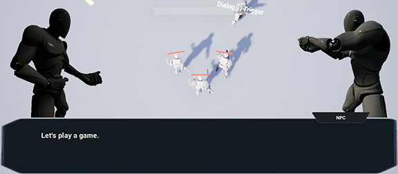
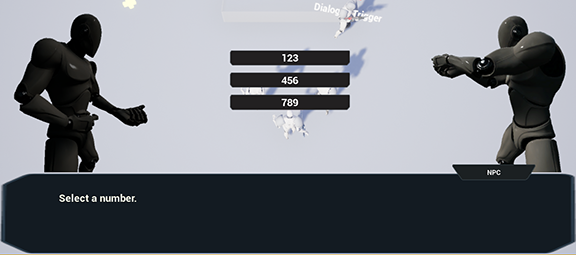

GenericGraphPlugin
==================

Generic graph data structure plugin for ue4

.. image:: docs/images/GenericGraph.png

Feature
-------

* Custom asset type
* UE4 BehaviorTree-like asset editor
* Extendable graph node type
* Extendable graph edge type

Usage
-----

* Ability system
* Dialogue system
* Quest system
* Etc

Install
-------

#. Clone this project to ${YourProject}/Plugins/
#. Generate project file
#. Compile

Example
-------

Dialogue System: SRPGTemplate_

.. _SRPGTemplate: https://github.com/jinyuliao/SRPGTemplate
