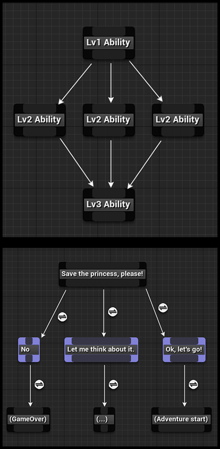

GenericGraphPlugin
==================

Generic graph data structure plugin for ue4

Feature
-------

* Custom asset type
* UE4 BehaviorTree-like asset editor
* Extendable graph node type
* Extendable graph edge type

Usage
-----

* SKill tree system
* Civilization-like technologies system
* Dialogue system
* Quest system
* etc

Install
-------

#. clone this project to ${YourProject}/Plugins/
#. generate project file
#. compile
